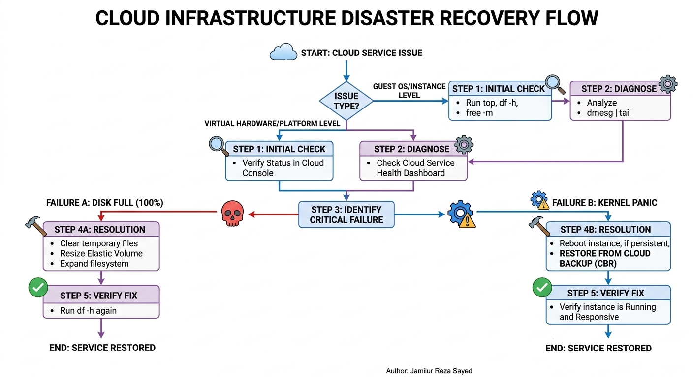

# Cloud-Ops-Disaster-Recovery
How to recover from cloud disaster stepby step guid.
# Cloud Infrastructure Reliability & Disaster Recovery

## 🎯 Project Objective
This repository serves as a professional **Operations Playbook**. It demonstrates my ability to diagnose, troubleshoot, and recover cloud infrastructure from critical failures, ensuring business continuity for enterprise-level applications.

## 🏗️ Recovery Flowchart

## 🛠️ Operational Skills Demonstrated
* **System Monitoring:** Using CLI tools (`top`, `df`, `dmesg`) to identify bottlenecks.
* **Storage Management:** Resizing elastic volumes and managing Linux file systems.
* **Data Integrity:** Implementing Cloud Backup and Recovery (CBR) strategies.
* **Automation:** Python scripts for proactive health monitoring.

## 📄 Key Resources
* [Incident Response Playbook](./incident_response_playbook.md)
* [Health Check Automation](./health_check.py)

---
**Author:** Jamilur Reza Sayed  
*Cloud Systems Engineer | IT Operations Specialist*
